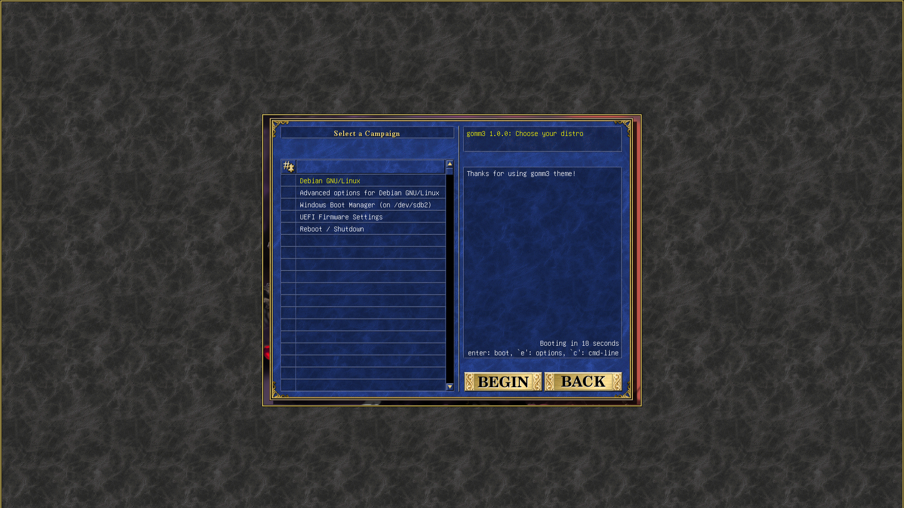

# gomm3
Heroes of Might and Magic 3 looking like grub2 theme! (for 1920x1080)



# Installation

- Clone this repository
```shell
git clone https://github.com/abakanovskii/gomm3.git
```

- Copy the folder
```shell
cd ./gomm3
sudo cp ./gomm3 /boot/grub/themes/
```

- Add these lines to `/etc/default/grub`
```shell
GRUB_THEME=/boot/grub/themes/gomm3/theme.txt
GRUB_BACKGROUND=/boot/grub/themes/gomm3/gomm3-assets/box_bg.png
GRUB_GFXMODE="1920x1080"
```

- Update grub config
```shell
sudo grub-mkconfig -o /boot/grub/grub.cfg
```

> Astrologers proclaim week of the gomm3
